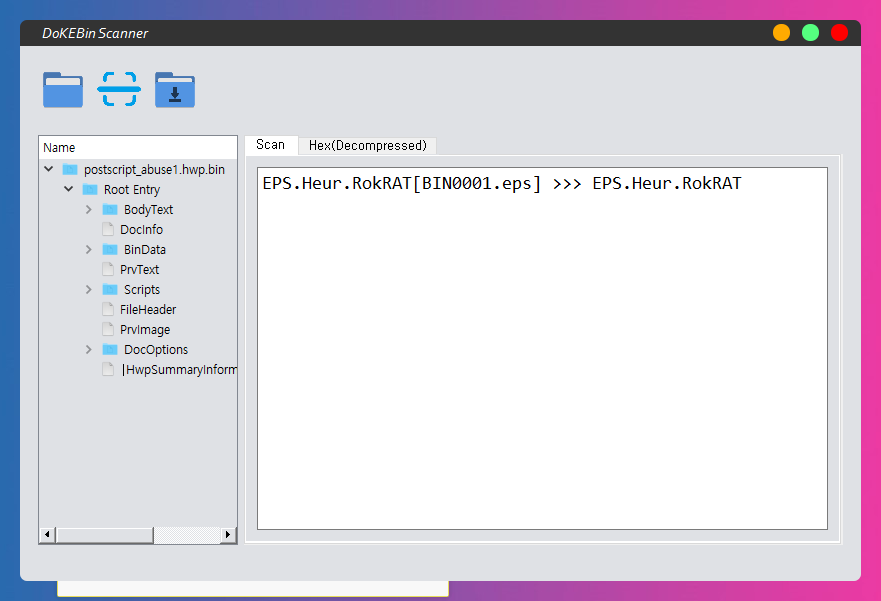

# DokEbin Scanner



## Description

Korean Hangul Word Document Formed Malware Scanner (Beta 0.1 v)


## Dependencies

* Python 3 >=
* PySide2 5.15.2 >=
* Yara (https://github.com/VirusTotal/yara/releases)


## Installing

```
1. git clone https://github.com/orca-eaa5a/dokkaebi_scanner.git

2. python setup.py install
```


## Executing program


```
python main.py
```


## Contacts

If there were some bugs please report at **Github Issues**


If you want to **report the binary which can't detected or causes False-Negative**, 

Please contacts use E-Mail to dlfguswn@naver.com


## Version History

* 0.1
    * Initial Release (Beta Ver)
* 0.1a
    * Implement large file browsing (Beta Ver)


## Acknowledgments

* ###### [VB2018] DOKKAEBI: Documents of Korean and Evil Binary

* ###### (한글 문서) 꼭꼭 숨어라 악성코드 보일라
  

